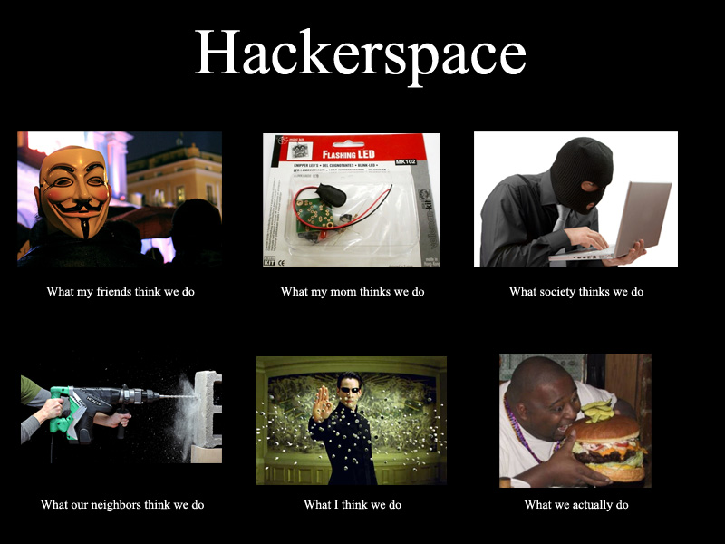

# Dundee MakerSpace.

Enabling everyone to create anything.

dundeemakerspace.co.uk

## Maker/Hackerspaces.

note:
- Originally started in Germany in the 90s
- Terms pretty much interchangable

### Community orientated workspace.

note:
- Brings together people with a common interest
- Generally a focus around things hard for people to do in their own homes due to cost / space

### Global movement.

&gt; 1000 around the world.

### Ethos not rules.

note:
- There are no set rules
- They are all run slightly differently

### All sorts of activities.

programming.
furniture.
sewing.
art.
electronics.
3D printing.
woodworking.
science.
laser cutting.
recycling.
weaving.
metalworking.
painting.
hacking.
research.
robotics.
repair.
sign making.
knitting.
models.
food.
etc.
etc.

### Flexible.

note:
- There are plenty of different things that could be considered makerspaces from garages to giant factories

note:
- Recently got tuck shop

## Our Business

note:
- Started in June 2014
- Limited by guarantee
- Social enterprise

### Volunteer run.

note:
- All done for fun
- Doesn't require full time
- Stuff > People

### Nimble.

note:
- No large board to hold us back
- People given the freedom to do what they want

### Member funded.

note:
- Keeps us away from strings
- Helps to nurture the community spirit
- Easy to manage

### Sustainable.

note:
- Funding great for improvements but do not want to be reliant

### Open.

Trello: [dms.rocks/trello](http://dms.rocks/trello)
Google Drive: [dms.rocks/drive](http://dms.rocks/drive)

note:
- We have no need for secrets
- Lets anyone contribute

## Past.

<!-- .slide: data-background="img/beer.jpg" -->
<h2 style="text-shadow: 0 0 .3em rgba(0,0,0,.9);">2014-04</h2>

note:
- Started as an idea from a friend in the pub
- Made a trip to Edinburgh Hacklab

<!-- .slide: data-background="img/makerspace-0.1.jpg" -->
<h2 style="text-shadow: 0 0 .3em rgba(0,0,0,.9);">2014-07</h2>

note:
- Started meeting in coffee shops to plan
- Got this room from a fiendly charity for an evening

<!-- .slide: data-background="img/makerspace-1.0.jpg" -->
<h2 style="text-shadow: 0 0 .3em rgba(0,0,0,.9);">2014-08</h2>

note:
- Got our first unit in August
- Small but charming
- 500sqft

<!-- .slide: data-background="img/makerspace-2.0.jpg" -->
<h2 style="text-shadow: 0 0 .3em rgba(0,0,0,.9);">2015-01</h2>

note:
- Got offered a space in the vision building at the end of 2015
- Actually viewed it previously and never thought we'd be able to afford it
- 6500sqft
- Completely empty

<!-- .slide: data-background="img/makerspace-2.5.jpg" -->
<h2 style="text-shadow: 0 0 .3em rgba(0,0,0,.9);">2015-05</h2>

note:
- Scraped together money and free stuff to fill it up

<!-- .slide: data-background="img/makerspace-3.0.jpg" -->
<h2 style="text-shadow: 0 0 .3em rgba(0,0,0,.9);">2016</h2>

note:
- Kept on growing despite lack of cash
- Built a lot of things ourself

### Events.

Robot wars.
Jams.
Hackathons.
Workshops.
Make / Share.

## Present.

### Slow steady growth.

note:
- Up to 20+ members

### Self sustaining.

note:
- Costs: rent, insurance, utilities
- More members = more money to spend on stuff

## Future.

### Employee.

note:
- Part time would be super helpful
- Applying for funding

### More events.

note:
- Events are great.
- Bring more people in -> more members
- Benefits attendees

### More collaborations.

note:
- We work with everyone
- Science festival, makerfaires, Creative Dundee, NEoN, DCA, IGDA etc.

### More stuff.

note:
- 3D printer
- Woodworking
- Starter kits

### More fun.

## Join in.

### Monday maker meetups.

Open to everyone every Monday evening from 6:30pm

note:
 - This is the time to come down and try see what's going on
 - Free for everyone!

### Membership.

- &pound;25 per month
- 24h access
- Open to everyone

### Find us.

Unit 5,
Vision Building

<!-- .slide: data-background="img/thanks.jpg" -->
<h1 style="text-shadow: 0 0 .3em rgba(0,0,0,.9);">Cheers.</h1>
